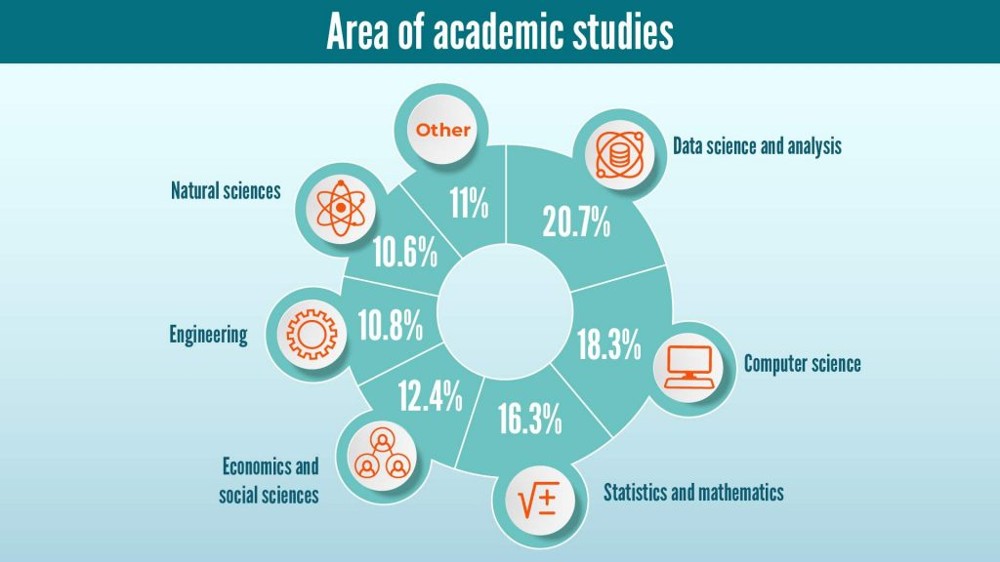

```{r configuracion, include = FALSE}
library(knitr)
library(tidyverse)
library(datos)
library(fontawesome)
library(emo)
library(xaringanExtra)
# set default options
opts_chunk$set(echo=FALSE,
               warning=FALSE,
               collapse = TRUE,
               dpi = 300)
knit_engines$set("yaml", "markdown")

xaringanExtra::use_tile_view()
xaringanExtra::use_clipboard()
xaringanExtra::use_share_again()
xaringanExtra::style_share_again(
  share_buttons = c("twitter", "linkedin", "pocket")
)
```

class: right, middle, inverse, titular
background-image: url(https://cdn.computerhoy.com/sites/navi.axelspringer.es/public/styles/1200/public/media/image/2019/03/java.jpg?itok=DrdDXiro)
background-size: contain
background-position: -150% 0%


# `r rmarkdown::metadata$title` 
### `r rmarkdown::metadata$author`
### `r rmarkdown::metadata$date`

[`r fontawesome::fa("github")` bit.ly/FLISoL_Marcabeli_2022](https://github.com/Lindajzmin/FLISoL_Marcabeli_2022)

---

class: middle, center

# Sobre mí


### Linda Cabrera Orellana `r emo::ji("ecuador")` <br> Co-organizadora RLadies Guayaquil

.fade[Profesora<br>Universidad Técnica de Machala<br>Machala, El Oro, Ecuador]


---

class: center, middle

# Agradecimientos

----

--

<br>
## [Ubuntu Ecuador](https://twitter.com/ubuntu_ecuador)

---

class: middle, center, inverse

`r fontawesome::fa("r-project", height = "3em")`
# ¿Por qué hacemos análisis de datos?

---

## `r fontawesome::fa("industry")` De la industria 1.0 a la industria 4.0

.center[]


---

## `r fontawesome::fa("industry")` Industria 4.0 - Los datos son la clave

.center[]


---

## `r fontawesome::fa("industry")` Volumen de datos en el mundo

.pull-left[
.center[
Fuente: [https://es.statista.com/](https://es.statista.com/grafico/26031/volumen-estimado-de-datos-digitales-creados-o-replicados-en-todo-el-mundo/)]]

--

.pull-right[
.center[
Fuente: [https://www.telefonica.com/es](https://www.telefonica.com/es/sala-comunicacion/que-pasa-en-un-minuto-en-internet-en-2021/)]]


---

class: middle, center, inverse

`r fontawesome::fa("r-project", height = "3em")`
# ¿Qué es el Análisis de Datos?

---

class: center, middle

### _"La analítica de datos (data analytics) implica los procesos y actividades diseñados para obtener y evaluar datos para extraer información útil."_

*Definición de ISACA, organización profesional de impacto mundial en
sistemas de información (gobierno, auditoría y seguridad), agosto 2011*

--

### _"Analítica de datos se considera también a la ciencia de examinar datos en bruto (crudos) con el propósito de obtener conclusiones acerca de la información contenida en ellos. Se utiliza en muchas industrias para permitir a organizaciones y empresas mejoras en la toma de decisiones. Este término se utiliza con gran profusión en el campo de la inteligencia de negocios (business intelligence)"_

*Libro _"Big Data Análisis de grandes volúmenes de datos en organizaciones"_ de
Luis Joyanes Aguilar*

---

class: middle, center, inverse

`r fontawesome::fa("r-project", height = "3em")`
# Ciclo de vida del análisis de datos

---


## `r fontawesome::fa("laptop")` Ciclo de vida de un proyecto de análisis de datos

.center[
]

---

class: middle, center, inverse

`r fontawesome::fa("r-project", height = "3em")`
# Tipos de análisis de datos

---

background-image: url("img/analysis1.png")
background-size: contain

--

background-image: url("img/analysis2.png")
background-size: contain

--

background-image: url("img/analysis3.png")
background-size: contain


---

## `r fontawesome::fa("laptop")` Ciencia de Datos

.pull-left[
.center[
### Habilidades de un científico de datos
]]

--

.pull-right[
.center[
### Aplicaciones de la ciencia de datos
]]


---

## `r fontawesome::fa("laptop")` Ciencia de Datos

.center[
 <br>
Fuente: [https://365datascience.com/](https://365datascience.com/career-advice/career-guides/become-data-scientist-2020/)]


---


class: middle, center, inverse

`r fontawesome::fa("r-project", height = "3em")`
# ¿Qué es R?

---

## `r fontawesome::fa("code")` Lenguajes de programación

.center[
 <br>
Fuente: [https://365datascience.com/](https://365datascience.com/career-advice/career-guides/become-data-scientist-2020/)]

---

## `r fontawesome::fa("code")` ¿Qué es `r fontawesome::fa("r-project")`?

.pull-left[
.center[
]]

--

.pull-right[
* Desarrollado por Robert Gentleman y Ross Ihaka del Departamento de Estadística de la Universidad de Auckland en 1993.

* Sus bases se remontan a finales de 1970 donde 2 científicos desarrollaron un sistema de análisis de datos en los laboratorios Bell de AT&T en Nueva Jersey que denominaron lenguaje S.

* Su nombre se debe a las iniciales de Robert y Ross.

* `r fontawesome::fa("r-project")` es un entorno de software libre y un lenguaje de programación interpretado orientado a objetos, usado para la computación estadística y los gráficos. 

* `r fontawesome::fa("r-project")` está disponible como Software Libre bajo los términos de la Licencia Pública General GNU de la Free Software Foundation en forma de código fuente. (Fuente: [r-project.org](https://www.r-project.org/))
]

---

## `r fontawesome::fa("code")` ¿Cuáles son sus beneficios?

.center[
]

---

## `r fontawesome::fa("code")` Instalando `r fontawesome::fa("r-project")`

* Descargar R en la página [cran.r-project.org](https://cran.r-project.org/)

.center[
]

---

background-image: url("img/consola.jpg")
background-size: contain

---

## `r fontawesome::fa("code")` RStudio

* Descargamos RStudio en la página [https://www.rstudio.com/](https://www.rstudio.com/products/rstudio/)

.center[
]

---

background-image: url("img/IDE.png")
background-size: contain

---

class: middle, center, inverse

# Análisis de datos con `r fontawesome::fa("r-project")`

---

background-image: url(https://i.ytimg.com/vi/8Q6J7E0FetU/maxresdefault.jpg)
background-size: cover
class: center, center, top

---

background-image: url("img/fifa.jpeg")
background-size: contain

---

background-image: url(https://neuraldojo.org/wp-content/uploads/2021/06/Analisis-de-Sentimiento-3-1024x524.jpg)
background-size: cover
class: center, center, top

---

.pull-left[
.center[


]]

.pull-right[
.center[


]]


---

class: middle, center, inverse

`r fontawesome::fa("exclamation", height = "3em")`
# Material extra

---

### * Libro ["R para Ciencia de Datos"](https://es.r4ds.hadley.nz/) de Hadley Wickham y Garrett Grolemund.

### * Club de Lectura del libro ["R para Ciencia de Datos"](https://youtu.be/OudE9Ag91PI) de Hadley Wickham y Garrett Grolemund por RLadies Guayaquil Galápagos Milagro y Barranquilla.

### * Curso ["Bases de R y Estadística para Ciencia de Datos"](https://youtu.be/ViiV4Kn_Dio) de la Sociedad Ecuatoriana de Estadística.

### * Unirse a una Comunidad

<br>

--

.center[_"Si caminas solo, irás más rápido; si caminas acompañado, llegarás más lejos"_]


---

class: inverse, middle, left

.pull-right[

# ¡Muchísimas gracias!

### Aqui es donde me puedes conseguir...

.right[
[`r fontawesome::fa("twitter")` @L1nd4J_C0](https://twitter.com/L1nd4J_C0)<br/>
[`r fontawesome::fa("github")` @Lindajzmin](https://github.com/Lindajzmin)<br/>
<br/>
[`r fontawesome::fa("twitter")` @RLadiesGye](https://twitter.com/RLadiesGye)<br/>
[`r fontawesome::fa("youtube")` R-Ladies Ecuador](https://www.youtube.com/channel/UCYjjz8ANtLZNu9u4P6tHh9g/featured)<br/>
[`r fontawesome::fa("meetup")` R-Ladies Guayaquil](https://www.meetup.com/es-ES/rladies-guayaquil/)
]]


